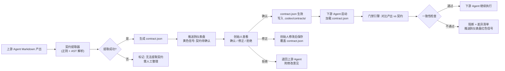
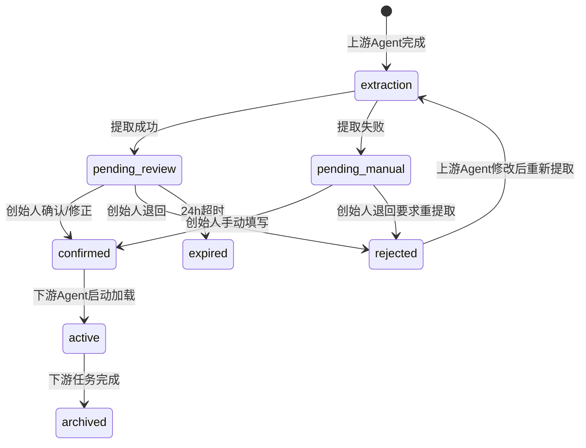

<!--
  Synova 创始人控制塔系统 | 第三章：契约存档器
  版本: v1.0 | 日期: 2026-07-22 | 作者: Synova 研究组
  定位: 架构设计文档——定义 Agent 交接时的接口契约自动提取、结构化存档、创始人确认与下游门禁机制
  前置输入: AGENTS.md 铁律 0-5 (23项已知错误清单), 铁律 4 (接线铁律), 铁律 38 (as any 零容忍)
  与前后章节关系: 第二章(任务拆分器)产出 Agent 任务清单 → 第三章(本设计)从上游产出中提取契约 → 第四章(写入锁)保护文件写入 → 第五章(外部审计器)验证产出质量
-->

# 第三章：契约存档器 (Contract Archiver)

> Agent 交接时从上游产出中自动提取接口契约 → 结构化 contract.json → 创始人确认后生效 → 下游 Agent 门禁强制比对
> 2026-07-22 | 基于 AGENTS.md v4.4.5 Iron Law 0-5, 铁律 4/38

---

## 1. 问题定义

### 1.1 核心矛盾

多 Agent 协作场景下，上游 Agent 的产出（新增文件、新增函数签名、Edge ID 命名、参数约定）构成下游 Agent 的"接口契约"。历史上，这些契约只存在于上游 Agent 的 Markdown 产出中——自然语言、非结构化的、无法被机器消费的。下游 Agent 凭"阅读理解"这些自然语言来编码，导致：

- **接线断链**（铁律 4 历史事故 4 次）：上游声明了 `setMainAgent()` 函数，下游从未调用
- **Edge ID 标签错误**（已知错误 #5）：D26 任务 3/5 Edge ID 写错，无人察觉
- **文件名不存在**（已知错误 #22）：引用了 `knowledge-curator.ts` 但文件不存在，无人验证

**核心主张**: Agent 之间的接口契约必须是可被机器消费的 JSON，不能依赖自然语言。

### 1.2 设计目标

| 目标 | 描述 | 对应铁律 |
|------|------|----------|
| 自动提取 | 从上游 Agent Markdown 产出中正则提取 Edge ID、参数名、文件名、函数签名 | 铁律 0-3 (必须读权威文档原文) |
| 结构化存档 | 输出 contract.json，Schema 可被机器解析 | 铁律 38 (as any 零容忍——类型安全) |
| 创始人确认 | contract.json 经创始人确认后才生效，未确认前下游 Agent 不启动 | 铁律 0 (协作对齐前置) |
| 门禁强制 | 下游 Agent 启动时自动加载 contract.json → 门禁引擎对比产出与契约 | 铁律 4 (接线铁律) |
| 失败安全 | 提取失败不阻塞，标记"需人工整理" | 铁律 31 (降级信号传播) |

---

## 2. 系统架构

### 2.1 数据流



### 2.2 组件清单

| 组件 | 文件路径 | 职责 |
|------|----------|------|
| 契约提取器 | `scripts/contract/extract-contract.sh` | 从上游 Markdown 中正则提取契约字段 |
| contract.json Schema | `src/contract/contract-schema.ts` | TypeScript interface 定义 |
| 契约存档服务 | `src/contract/contract-store.ts` | 读写 .codex/contracts/ 目录 |
| 门禁引擎 | `src/contract/contract-gate.ts` | 下游 Agent 启动时加载 contract.json 并比对 |
| 仪表盘信号 | `src/contract/contract-signal.ts` | 推送"契约待确认"黄色信号到仪表盘 |

---

## 3. contract.json 自动提取逻辑

### 3.1 提取源与正则规则

契约提取器 (`scripts/contract/extract-contract.sh`) 从上游 Agent 的 Markdown 产出中扫描以下模式：

| 提取目标 | 正则模式 | 示例源文本 | 提取结果 |
|----------|----------|-----------|----------|
| Edge ID | `\bD\d+[a-z]?\b` | "完成 D8f 后进入 D9" | `["D8f", "D9"]` |
| 新增文件名 | `新增文件[：:]\s*` + 路径模式 | "新增文件: src/l3/expert-dispatcher.ts" | `"src/l3/expert-dispatcher.ts"` |
| 新增函数签名 | `export function \w+\([^)]*\)` | "export function setMainAgent(id: string): void" | `{"name":"setMainAgent","params":"id: string","return":"void"}` |
| 修改文件名 | `修改文件[：:]\s*` + 路径模式 | "修改文件: src/agent/conversation-engine.ts" | `"src/agent/conversation-engine.ts"` |
| 参数约定 | `参数[：:]\s*\w+\s*[：:]\s*.+` | "参数: timeoutMs: number (默认 5000)" | `{"name":"timeoutMs","type":"number","default":5000}` |
| 数据源引用 | `数据源[：:]\s*.+` | "数据源: /api/sentinel/reports" | `"/api/sentinel/reports"` |

### 3.2 提取流程伪代码

```
function extractContract(markdownContent: string): ContractExtractionResult {
  const edges = matchAll(markdownContent, /\bD\d+[a-z]?\b/g);
  const newFiles = extractAfterLabel(markdownContent, /新增文件[：:]\s*/);
  const modifiedFiles = extractAfterLabel(markdownContent, /修改文件[：:]\s*/);
  const functions = extractFunctions(markdownContent, /export function \w+\([^)]*\)/g);
  const params = extractParams(markdownContent, /参数[：:]\s*\w+\s*[：:]\s*.+/g);
  const dataSources = extractAfterLabel(markdownContent, /数据源[：:]\s*/);

  if (edges.length === 0 && newFiles.length === 0 && functions.length === 0) {
    return { status: 'extraction_failed', reason: 'no_extractable_contract' };
  }

  return {
    status: 'extracted',
    contract: { edges, newFiles, modifiedFiles, functions, params, dataSources },
    confidence: calculateConfidence(edges, newFiles, functions)
  };
}
```

### 3.3 置信度评分

提取完成后，系统计算置信度分数（0-1）：

| 信号 | 加分 | 说明 |
|------|------|------|
| Edge ID > 0 | +0.3 | 有明确的任务引用 |
| 新增文件 > 0 | +0.2 | 有明确的文件产出 |
| 函数签名 > 0 | +0.2 | 有明确的接口定义 |
| 参数约定 > 0 | +0.15 | 有明确的参数规范 |
| 数据源引用 > 0 | +0.15 | 有明确的数据依赖 |

置信度 < 0.5 → 标记为"低置信度提取"，在仪表盘上显示橙色信号（低于黄色"待确认"，高于红色"阻断"）。

---

## 4. contract.json Schema 定义

### 4.1 TypeScript Interface

```typescript
// src/contract/contract-schema.ts

/** 单个函数签名契约 */
interface FunctionContract {
  /** 函数名 */
  name: string;
  /** 参数签名原文 (如 "id: string, opts?: RunOptions") */
  params: string;
  /** 返回类型原文 (如 "Promise<DiagnosisReport>") */
  returnType: string;
  /** 是否为 async 函数 */
  isAsync: boolean;
  /** 导出方式: "named" | "default" */
  exportType: 'named' | 'default';
}

/** 参数约定 */
interface ParamContract {
  /** 参数名 */
  name: string;
  /** TypeScript 类型 */
  type: string;
  /** 默认值 (JSON 字面量) */
  default?: unknown;
  /** 正常范围描述 */
  range?: string;
  /** 是否必填 */
  required: boolean;
}

/** 文件契约 */
interface FileContract {
  /** 相对于仓库根目录的路径 */
  path: string;
  /** 操作类型 */
  operation: 'create' | 'modify' | 'delete';
  /** 预期的导出 (仅 create/modify) */
  expectedExports?: string[];
}

/** 完整契约文档 */
interface ContractDocument {
  /** Schema 版本 */
  schemaVersion: '1.0.0';
  /** 契约 ID，唯一标识 */
  contractId: string;
  /** 上游 Agent 任务 ID */
  upstreamTaskId: string;
  /** 下游 Agent 任务 ID 列表 */
  downstreamTaskIds: string[];
  /** 提取时间 (ISO 8601) */
  extractedAt: string;
  /** 提取置信度 0-1 */
  extractionConfidence: number;

  /** Edge ID 列表 */
  edgeIds: string[];
  /** 新增文件列表 */
  newFiles: FileContract[];
  /** 修改文件列表 */
  modifiedFiles: FileContract[];
  /** 新增函数签名列表 */
  functions: FunctionContract[];
  /** 参数约定列表 */
  params: ParamContract[];
  /** 数据源引用列表 */
  dataSources: string[];

  /** 契约状态 */
  status: 'pending_review' | 'confirmed' | 'rejected' | 'expired';
  /** 确认者 (创始人或指定审核者) */
  confirmedBy?: string;
  /** 确认时间 (ISO 8601) */
  confirmedAt?: string;
  /** 创始人修正内容 (若修正) */
  amendments?: string;
}
```

### 4.2 contract.json 示例

```json
{
  "schemaVersion": "1.0.0",
  "contractId": "CONTRACT-D8f-D9-20260722-001",
  "upstreamTaskId": "D8f",
  "downstreamTaskIds": ["D9"],
  "extractedAt": "2026-07-22T10:30:00+08:00",
  "extractionConfidence": 0.75,
  "edgeIds": ["D8f", "D9"],
  "newFiles": [
    {
      "path": "src/l3/expert-dispatcher.ts",
      "operation": "create",
      "expectedExports": ["ExpertDispatcher", "DispatchResult"]
    }
  ],
  "modifiedFiles": [
    {
      "path": "src/agent/conversation-engine.ts",
      "operation": "modify",
      "expectedExports": ["setMainAgent"]
    }
  ],
  "functions": [
    {
      "name": "setMainAgent",
      "params": "id: string",
      "returnType": "void",
      "isAsync": false,
      "exportType": "named"
    },
    {
      "name": "dispatchToExpert",
      "params": "signal: SentinelSignal, context: DiagnosisContext",
      "returnType": "Promise<DispatchResult>",
      "isAsync": true,
      "exportType": "named"
    }
  ],
  "params": [
    {
      "name": "timeoutMs",
      "type": "number",
      "default": 5000,
      "range": "1000-30000",
      "required": false
    }
  ],
  "dataSources": [
    "/api/sentinel/reports",
    "/api/sentinel/tickets"
  ],
  "status": "pending_review"
}
```

---

## 5. 创始人确认流程

### 5.1 确认界面

contract.json 生成后，推送到仪表盘。创始人看到：

```
+------------------------------------------------------+
|  (Y) 契约待确认  CONTRACT-D8f-D9-001                  |
|  上游: D8f (ExpertDispatcher)                         |
|  下游: D9  (Sentinel Integration)                     |
|  置信度: 75%                                          |
|  提取时间: 2026-07-22 10:30                           |
|                                                       |
|  新增文件 (1):                                        |
|    + src/l3/expert-dispatcher.ts                      |
|      exports: ExpertDispatcher, DispatchResult         |
|                                                       |
|  修改文件 (1):                                        |
|    ~ src/agent/conversation-engine.ts                 |
|      exports: setMainAgent                            |
|                                                       |
|  新增函数 (2):                                        |
|    setMainAgent(id: string): void                     |
|    dispatchToExpert(...)                              |
|                                                       |
|  Edge IDs: D8f, D9                                    |
|  ----------------------------------------------       |
|  [确认] [修正] [退回上游]                               |
+------------------------------------------------------+
```

### 5.2 三种确认结果

| 操作 | 结果 | 下游 Agent 行为 |
|------|------|----------------|
| **确认** | status → `confirmed`, confirmedBy 记录创始人 ID, confirmedAt 记录时间 | 下游 Agent 可启动，门禁引擎加载此 contract.json |
| **修正** | 创始人直接编辑 contract.json 内容后保存，status → `confirmed`，amendments 记录修改说明 | 同"确认" |
| **退回上游** | status → `rejected`，附退回原因 | 下游 Agent 不被阻塞，但无法获取契约。上游 Agent 收到通知，修改 Markdown 产出后重新提取 |

### 5.3 超时策略

- 契约生成后 4 小时内未确认 → 仪表盘信号从黄色升级为橙色（"超时未确认"）
- 24 小时未确认 → contract.json 标记为 `expired`，下游 Agent 启动时以 `degraded: true` 模式运行——跳过契约门禁但记录告警

---

## 6. 下游 Agent 门禁引擎

### 6.1 启动时检查流程

```
function gateCheck(contractPath: string, workspacePath: string): GateResult {
  const contract = loadContract(contractPath);

  if (contract.status !== 'confirmed') {
    return { pass: false, reason: 'contract_not_confirmed' };
  }

  const violations: GateViolation[] = [];

  // 检查 1: 新增文件是否存在
  for (const file of contract.newFiles) {
    if (!fs.existsSync(join(workspacePath, file.path))) {
      violations.push({
        type: 'missing_file',
        expected: file.path,
        severity: 'error'
      });
    }
  }

  // 检查 2: 新增函数签名是否匹配 (grep 代码库)
  for (const fn of contract.functions) {
    const grepResult = grep(workspacePath, `export function ${fn.name}\\(`);
    if (grepResult.length === 0) {
      violations.push({
        type: 'missing_function',
        expected: `${fn.name}(${fn.params}): ${fn.returnType}`,
        severity: 'error'
      });
    }
  }

  // 检查 3: 修改文件的预期导出是否存在
  for (const file of contract.modifiedFiles) {
    if (!file.expectedExports) continue;
    for (const exp of file.expectedExports) {
      const isExported = grep(workspacePath, `export.*${exp}`, file.path);
      if (!isExported) {
        violations.push({
          type: 'missing_export',
          file: file.path,
          expected: exp,
          severity: 'warn'
        });
      }
    }
  }

  return {
    pass: violations.filter(v => v.severity === 'error').length === 0,
    violations
  };
}
```

### 6.2 门禁结果

| 结果 | 含义 | 仪表盘信号 | Agent 行为 |
|------|------|-----------|-----------|
| 全部通过 | 下游产出与契约完全一致 | 绿色 | 正常执行 |
| 仅有 warning | 存在偏差但不致命（如缺少一个非关键 export） | 黄色 | 继续执行，偏差清单写入任务日志 |
| 有 error | 关键契约未满足（如文件缺失、函数签名不匹配） | 红色 | 阻断，差异清单推送仪表盘 |

---

## 7. 失败模式与降级

### 7.1 提取失败

**场景**: 上游 Agent 的 Markdown 产出中找不到任何可提取的契约字段。

**处理**:
1. 契约提取器返回 `{ status: 'extraction_failed', reason: 'no_extractable_contract' }`
2. 系统生成一份空骨架 contract.json，status 设为 `pending_manual`
3. 仪表盘推送黄色信号："无法自动提取契约，需人工整理"
4. 创始人可手动填写 contract.json 或退回上游 Agent 要求补充

### 7.2 门禁引擎自身失败

**场景**: 门禁引擎在加载 contract.json 或执行文件系统检查时抛出异常。

**处理**:
1. catch 块 → `log.error('contract gate engine failed', { error })`（铁律 24：不能空吞）
2. 返回 `{ pass: false, reason: 'gate_engine_error', degraded: true }`（铁律 31：降级信号传播）
3. 仪表盘推送红色信号："契约门禁引擎异常，下游 Agent 已暂停"
4. 不自动降级为"放行"——契约门禁失败时必须人工介入

### 7.3 contract.json 文件损坏

**场景**: .codex/contracts/ 下的 JSON 文件被手动编辑导致格式错误。

**处理**:
1. JSON.parse 失败 → `log.error('contract.json parse error', { path, error })`
2. 返回 `{ pass: false, reason: 'contract_corrupted' }`
3. 仪表盘推送红色信号："契约文件损坏，需重建"

---

## 8. 存储与生命周期

### 8.1 存储路径

```
.codex/contracts/
  ├── CONTRACT-D8f-D9-20260722-001.json    # 已确认的契约
  ├── CONTRACT-D10-D11-20260723-002.json    # 待确认的契约
  └── archive/
      └── CONTRACT-D1-D2-20260601-001.json  # 已完成的契约归档
```

### 8.2 生命周期



---

## 9. 与现有系统集成

### 9.1 与 pre-commit 的关系

contract.json 不取代 pre-commit hook。两者互补：

| 机制 | 触发时机 | 检查内容 |
|------|----------|----------|
| contract.json 门禁 | Agent 启动时 | 跨 Agent 接口契约一致性 |
| pre-commit hook | git commit 时 | 单 Agent 代码质量 (as any, catch, secrets, 测试配对, 接线) |

### 9.2 与 PostToolUse hook 的关系

PostToolUse hook 的 L4 接线审计 (`verify-incremental.sh`) 检查"新 export 是否有调用方"。contract.json 门禁在此基础之上增加了"调用方是否匹配契约预期"的语义层检查。

### 9.3 与仪表盘信号系统

契约状态信号通过 `src/contract/contract-signal.ts` 推送到仪表盘，与 Sentinel 工单、诊断报告共享同一信号总线。信号格式：

```typescript
interface ContractSignal {
  type: 'contract';
  contractId: string;
  status: 'pending_review' | 'confirmed' | 'rejected' | 'expired' | 'gate_violation';
  severity: 'green' | 'yellow' | 'red';
  message: string;
  timestamp: string;
}
```

---

## 10. 测试规范

### Test Requirements

| 测试层 | 类型 | Fixture 数量 | 覆盖场景 |
|--------|------|-------------|----------|
| L1 (单元) | `contract-schema.test.ts` | 3 | Schema 校验: 合法 JSON、缺少必填字段、类型错误 |
| L1 (单元) | `contract-store.test.ts` | 3 | 读写 contract.json、目录不存在自动创建、JSON 损坏返回 degraded |
| L1 (单元) | `extract-contract.test.ts` | 5 | 正常提取、空 Markdown、只有 Edge ID 无文件、中文乱码、混合中英文 |
| L2a (集成) | `contract-gate.integration.test.ts` | 4 | 全部通过、文件缺失(error)、导出缺失(warning)、契约未确认阻断 |
| L2c (E2E) | `contract-pipeline.e2e.test.ts` | 2 | 完整流程: 提取→确认→门禁通过 / 提取失败→人工填写→确认→门禁通过 |

### Wiring Verification

| 新 export | 调用方文件 | 调用方函数 |
|-----------|-----------|-----------|
| `ContractDocument` (contract-schema.ts) | `src/contract/contract-store.ts` | `loadContract()`, `saveContract()` |
| `extractContract()` (contract-store.ts) | `scripts/contract/extract-contract.sh` | (shell 调用) |
| `gateCheck()` (contract-gate.ts) | `src/agent/diagnosis-launcher.ts` | `launchDownstreamAgent()` |
| `pushContractSignal()` (contract-signal.ts) | `src/contract/contract-gate.ts` | `gateCheck()` |

---

> 下一章: [第四章：写入锁](./SYNOVA-RESEARCH-第四章-写入锁-v1-0-20260722.md) — 多 Agent 并行场景下的文件写入冲突防护