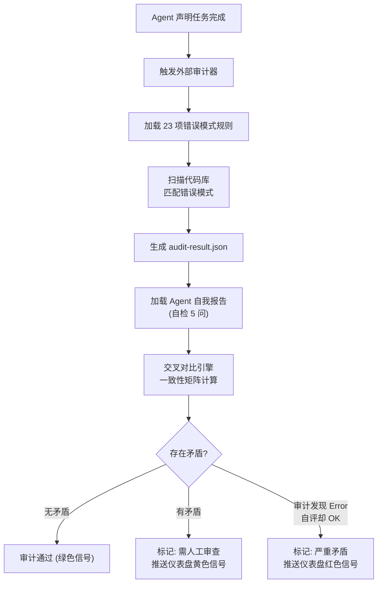
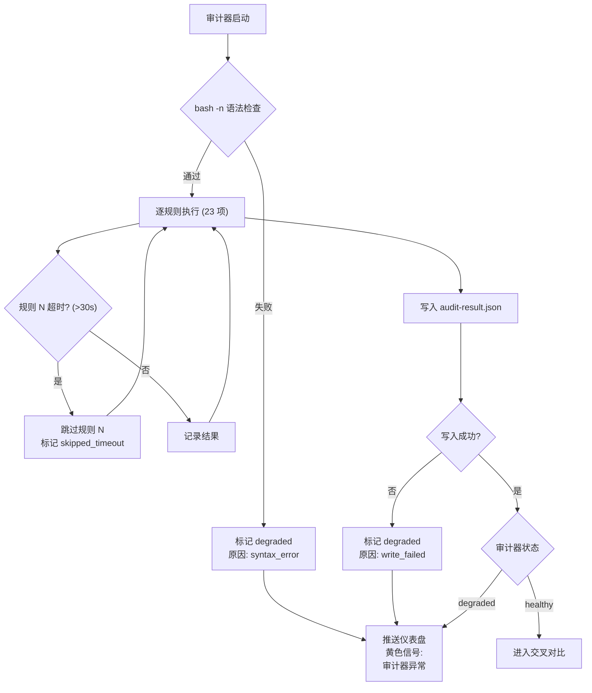

<!--
  Synova 创始人控制塔系统 | 第五章：外部审计器
  版本: v1.0 | 日期: 2026-07-22 | 作者: Synova 研究组
  定位: 架构设计文档——基于 23 项已知错误模式的自动化外部审计器，与 Agent 自我报告交叉对比，矛盾时标记人工审查
  前置输入: AGENTS.md 铁律 0-5 (23项已知错误清单), 铁律 24 (异常处理审计), 铁律 31 (降级信号传播)
  与前后章节关系: 第四章(写入锁)保护文件写入 → 第五章(本设计)验证产出质量 → 第六章(环境验证器)保证运行环境一致
-->

# 第五章：外部审计器 (External Auditor)

> Agent 声明"完成"后自动触发 → 扫描代码匹配 23 项已知错误模式 → 与 Agent 自我报告交叉对比 → 矛盾标记"需人工审查" → 审计器自身失败降级不阻断
> 2026-07-22 | 基于 AGENTS.md v4.4.5 Iron Law 0-5, 铁律 24/31

---

## 1. 问题定义

### 1.1 核心矛盾

Agent 的"自我报告"不可全信。历史上：

- **已知错误 #9**: D8d 任务 Agent 自检说"审计通过"，但代码中存在 `expertType='unknown'` 的真实 bug
- **已知错误 #8**: 审计标准仅有"文件名存在 + as any = 0"两条规则，覆盖面严重不足
- **已知错误 #10**: 测试文件缺失但 Agent 未发现，自我报告中声称"全部测试通过"

现有的 Agent 自检 5 问（铁律 0-5 定义的写完代码后自答）依赖 Agent 的主观判断。Agent 可能在以下情况下给出错误的自我报告：未完全理解检查标准、遗漏了边缘情况、或简单地"跳过"了部分检查。

**核心主张**: Agent 自我报告需要独立外部审计器的交叉验证。审计器的判断规则来自 23 项已知错误模式（物理事实），审计器不信任 Agent 的自我报告，而是独立扫描代码。

### 1.2 审计哲学

| 原则 | 说明 |
|------|------|
| **不信任 Agent** | 审计器不读取 Agent 自我报告来"验证"——它从头独立扫描代码 |
| **只检查物理事实** | 类似 pre-commit 的 bash 门禁：文件存在？符号被引用？语法合法？不判断语义正确性 |
| **矛盾不自动裁决** | 审计器标记 Error 但 Agent 自评 OK → 标记"需人工审查"，不自动判定谁对谁错 |
| **审计器自身可失败** | 审计脚本崩溃 → 标记审计器状态为 degraded → 通知创始人 → 不阻断 Agent 流程 |

### 1.3 设计目标

| 目标 | 描述 | 对应铁律 |
|------|------|----------|
| 自动触发 | Agent 每次声明"完成"后自动运行审计 | 自动化优先 (铁律 35) |
| 23 项错误覆盖 | 审计规则与 AGENTS.md Iron Law 0-5 逐项对齐 | 铁律 0-5 |
| 交叉对比 | Agent 自检 5 问 vs 外部审计 → 一致性矩阵 | 铁律 0 (协作对齐) |
| 矛盾安全 | 审计器与 Agent 结论矛盾 → 标记人工审查，不自动裁决 | 铁律 31 (降级信号传播) |
| 审计器降级 | 审计脚本自身失败 → degraded → 通知创始人 | 铁律 24 (异常处理审计) |

---

## 2. 系统架构

### 2.1 数据流



### 2.2 审计触发时机

```
Agent 生命周期中的三个触发点:

① PostToolUse Hook 后 — 每次文件写入完成后触发增量审计 (只扫描变更文件)
② Agent 声明"完成"后 — 触发全量审计 (扫描全仓库)
③ 创始人手动触发   — bash scripts/audit/audit-runner.sh --full
```

### 2.3 组件清单

| 组件 | 文件路径 | 职责 |
|------|----------|------|
| 审计规则引擎 | `scripts/audit/audit-rules.sh` | 23 项错误模式的检测规则 (可独立运行的 bash 脚本) |
| 审计运行器 | `scripts/audit/audit-runner.sh` | 调度审计规则引擎，生成 audit-result.json |
| 交叉对比引擎 | `scripts/audit/cross-check.sh` | 加载 Agent 自我报告 + audit-result.json → 一致性矩阵 |
| 审计结果存储 | `.codex/audit/` | 历史审计结果存档，支持趋势分析 |

---

## 3. 23 项已知错误模式审计规则

### 3.1 错误检测规则表

| # | 错误模式 | 检测方法 | 严重度 |
|---|---------|---------|--------|
| 1 | 不读权威文档就写 | 检查 task brief 中是否引用了权威文档原文段落 (正则: `权威\d+ §\d+`) | error |
| 2 | 不引用测试权威规范 #6 | 检查 dev doc 中是否包含 "L1/L2a/L2c" 和 "fixture" 关键词 | error |
| 3 | 不写接线要求 | 检查 dev doc Wiring Verification 节是否存在 + 是否包含 grep 命令或调用方路径 | error |
| 4 | Q4 测试数量矛盾 | 检查 dev doc Test Requirements 表中的数量与 task brief Q4 的契约数量是否一致 | warn |
| 5 | Edge ID 标签错误 | grep Edge ID (如 D26) → 对比 AGENTS.md / 权威文档中该 Edge ID 的定义 | error |
| 6 | UI 标签页写错 | grep 前端代码中的标签页名称 → 对比权威文档中的合法标签页列表 | error |
| 7 | 流水线式生产 | 检查相邻两个 task brief 的时间戳间隔 < 30 分钟且 git diff 行数 < 5 → 疑似未充分验证 | warn |
| 8 | 审计标准单薄 | 检查 audit-result.json 的 `rulesApplied` 字段数 ≥ 18 (全部 23 项的 80%) | warn |
| 9 | 声称通过但有 bug | 检查 Agent 自检 5 问全部为"是"，但 audit-result.json 有 ≥ 1 个 error | error |
| 10 | 测试文件缺失 | 对每个 `src/**/*.ts` (非测试文件)，检查是否存在 `src/**/__tests__/*.test.ts` 或同级 `.test.ts` | error |
| 11 | 半成品放过 | 检查 git diff 中是否存在 `TODO` / `FIXME` / `mock` / `placeholder` 关键词 | error |
| 12 | 接线断链 | 对每个新增 export，grep 全仓库检查是否有调用方 (排除自身文件和测试文件) | error |
| 13 | 中文乱码 | 检查 git diff 中是否包含 `\uFFFD` (Unicode 替换字符) 或 `?` 乱码模式 | error |
| 14 | 仪表盘滞后 | 检查 `.codex/loop-state.json` 中任务完成时间 vs 仪表盘更新时间间隔 > 24h | warn |
| 15 | section 编号冲突 | 检查 dev doc 中是否存在重复的 section 编号 (如两个 `## 16`) | warn |
| 16 | 任务计数出错 | 对比 AGENTS.md 中声明的任务总数 vs `.codex/task-briefs/` 目录下的文件数 | warn |
| 17 | --no-verify 依赖 | 检查 `.claude/bypass.log` 中是否存在非空的绕过记录 | error |
| 18 | pre-commit 超时绕过 | 检查 `.claude/last-precommit-success` 时间戳 vs commit 时间戳间隔 > 120s | warn |
| 19 | 缺少 task brief | 检查 Agent 完成声明时是否在 `.codex/task-briefs/` 下存在对应的 brief 文件 | error |
| 20 | 同类 bug 反复出现 | 对比本次 audit-result.json 与历史存档，同一类型 error 出现 ≥ 3 次 → 标记 | warn |
| 21 | 数据源搞错 | grep API 调用 → 对比 AGENTS.md 或权威文档中声明的合法 API 端点列表 | error |
| 22 | 引用不存在的文件 | grep dev doc 中出现的文件路径 → 逐条 `test -f` 验证 | error |
| 23 | 并行写冲突 | 检查 git log 中同一文件在 < 5 分钟的窗口内被两个不同 author 修改 | warn |

### 3.2 检测脚本骨架 (audit-rules.sh)

```bash
#!/bin/bash
# scripts/audit/audit-rules.sh — 23 项错误模式独立检测

ROOT="$(git rev-parse --show-toplevel 2>/dev/null || pwd)"
REPORT_FILE="${1:-.codex/audit/audit-result.json}"

# 初始化报告
echo '{"timestamp":"'$(date -u +%Y-%m-%dT%H:%M:%SZ)'","rulesApplied":[],"findings":[],"summary":{"errors":0,"warnings":0,"passes":0}}' > "$REPORT_FILE"

# Rule 1: 不读权威文档就写
check_rule_01() {
  # 检查 task brief 中是否引用权威文档 (如 "权威01 §3.2")
  local task_briefs=$(find "$ROOT/.codex/task-briefs" -name "*.md" -newer "$ROOT/.codex/last-audit-timestamp" 2>/dev/null)
  local violations=0
  for brief in $task_briefs; do
    if ! grep -qE '权威\d+ §\d+' "$brief" 2>/dev/null; then
      add_finding "01" "error" "Task brief $brief 未引用权威文档原文段落" "$brief"
      violations=$((violations + 1))
    fi
  done
  [ $violations -eq 0 ] && add_rule_pass "01" "所有 task brief 均引用权威文档"
}

# Rule 2: 不引用测试权威规范 #6
check_rule_02() {
  local dev_docs=$(find "$ROOT/docs" -name "*.md" -newer "$ROOT/.codex/last-audit-timestamp" 2>/dev/null)
  for doc in $dev_docs; do
    if echo "$doc" | grep -qi "impl\|实施\|施工\|对齐"; then
      if ! grep -qE 'L1.*L2a.*L2c|fixture' "$doc" 2>/dev/null; then
        add_finding "02" "error" "Dev doc $doc 未引用测试权威规范 #6 (L1/L2a/L2c + fixture)" "$doc"
      fi
    fi
  done
}

# Rule 5: Edge ID 标签错误
check_rule_05() {
  # 提取 dev doc 中所有 Edge ID
  local edge_ids=$(grep -rohE '\bD\d+[a-z]?\b' "$ROOT/docs" 2>/dev/null | sort -u)
  for eid in $edge_ids; do
    # 在 AGENTS.md 中搜索该 Edge ID 的定义
    if ! grep -q "$eid" "$ROOT/AGENTS.md" 2>/dev/null; then
      add_finding "05" "warn" "Edge ID $eid 在 dev doc 中出现但在 AGENTS.md 中未定义" ""
    fi
  done
}

# Rule 8: 审计标准单薄
check_rule_08() {
  local rule_count=$(jq '.rulesApplied | length' "$REPORT_FILE" 2>/dev/null || echo 0)
  if [ "$rule_count" -lt 18 ]; then
    add_finding "08" "warn" "审计规则仅覆盖 $rule_count/23 项 (< 80%%)" ""
  fi
}

# Rule 10: 测试文件缺失
check_rule_10() {
  local src_files=$(find "$ROOT/src" -name "*.ts" ! -name "*.test.ts" ! -name "*.spec.ts" ! -path "*/__tests__/*" 2>/dev/null)
  for src in $src_files; do
    local base=$(basename "$src" .ts)
    local dir=$(dirname "$src")
    # 检查同级 .test.ts 或 __tests__/ 目录
    if [ ! -f "$dir/$base.test.ts" ] && [ ! -f "$dir/__tests__/$base.test.ts" ]; then
      add_finding "10" "error" "源文件 $src 缺少对应测试文件" "$src"
    fi
  done
}

# Rule 11: 半成品放过 (TODO/FIXME/mock)
check_rule_11() {
  local todos=$(grep -rnE '(TODO|FIXME|HACK|XXX|mock\(|placeholder)' "$ROOT/src" --include="*.ts" 2>/dev/null)
  if [ -n "$todos" ]; then
    echo "$todos" | while read -r line; do
      add_finding "11" "error" "代码中存在 TODO/FIXME/mock: $line" ""
    done
  fi
}

# Rule 12: 接线断链
check_rule_12() {
  # 获取 git diff 中所有新增的 export
  local new_exports=$(git diff HEAD~1 -- "$ROOT/src" | grep '^+export ' | grep -oE '(function|const|class|interface|type|enum) \w+' | awk '{print $2}' | sort -u)
  for exp in $new_exports; do
    # grep 全仓库 (排除自身和测试文件)
    local refs=$(grep -rl "$exp" "$ROOT/src" --include="*.ts" ! -name "*.test.ts" 2>/dev/null | wc -l)
    if [ "$refs" -le 1 ]; then
      add_finding "12" "error" "新增 export '$exp' 无调用方 (接线断链)" ""
    fi
  done
}

# Rule 13: 中文乱码
check_rule_13() {
  local garbled=$(git diff HEAD~1 | grep -P '\x{FFFD}|�' 2>/dev/null)
  if [ -n "$garbled" ]; then
    add_finding "13" "error" "代码中包含 Unicode 替换字符 (中文乱码)" ""
  fi
}

# Rule 22: 引用不存在的文件
check_rule_22() {
  local file_refs=$(grep -rohE '`[^`]+\.(ts|tsx|js|sh|json|md)`' "$ROOT/docs/synova/research" 2>/dev/null | tr -d '`' | sort -u)
  for ref in $file_refs; do
    if [ ! -f "$ROOT/$ref" ]; then
      add_finding "22" "error" "文档引用不存在的文件: $ref" ""
    fi
  done
}

# ... (其余规则类似实现)
```

---

## 4. 交叉对比引擎

### 4.1 Agent 自我报告格式

Agent 在完成后输出自检 5 问的结果 (JSON 格式)，存放在 `.codex/self-reports/` 目录：

```json
{
  "taskId": "D97",
  "timestamp": "2026-07-22T11:00:00+08:00",
  "selfCheck": {
    "q1_wiring": { "pass": true, "detail": "grep -rn setMainAgent src/ 确认 3 处调用" },
    "q2_error_handling": { "pass": true, "detail": "所有 catch 块均有 log.warn/error + degraded 返回" },
    "q3_type_safety": { "pass": true, "detail": "as any 计数为 0" },
    "q4_test_quality": { "pass": true, "detail": "6 个测试，全部包含 expect() 断言" },
    "q5_cleanup": { "pass": true, "detail": "无死代码，旧文件已删除" }
  }
}
```

### 4.2 一致性矩阵

交叉对比引擎加载 Agent 自我报告 + audit-result.json → 构建 5×23 一致性矩阵：

```
           │ 审计器: Pass │ 审计器: Warn │ 审计器: Error │
───────────┼──────────────┼──────────────┼───────────────┤
Agent: OK  │  ✓ 一致      │  ! 审计器更严 │  🔴 严重矛盾  │
Agent: WARN│  - Agent 更严 │  ✓ 一致      │  ! 审计器更严 │
Agent: ERR │  - Agent 更严 │  - Agent 更严 │  ✓ 一致       │
```

### 4.3 矛盾处理决策表

| 矩阵位置 | 含义 | 处理 | 仪表盘信号 |
|----------|------|------|-----------|
| **Agent: OK × 审计器: Error** | 审计器发现 Agent 未报告的严重问题 | 标记"需人工审查"，附审计器发现的具体违规清单 | 红色 |
| **Agent: OK × 审计器: Warn** | 审计器发现 Agent 未报告的轻微问题 | 标记"建议复核"，不阻断，将审计器发现附在任务日志中 | 黄色 |
| **Agent: WARN/ERR × 审计器: Pass** | Agent 自我批评但审计器未发现 | 不标记矛盾——Agent 自我严格是好事 | 绿色 |
| **双方一致 (Pass/Pass, Warn/Warn, Error/Error)** | 一致 | 正常通过 | 绿色 |

### 4.4 交叉对比伪代码

```bash
# scripts/audit/cross-check.sh

cross_check() {
  local SELF_REPORT="$1"    # Agent 自我报告 JSON
  local AUDIT_RESULT="$2"   # 审计结果 JSON

  local matrix="一致"

  # 提取 Agent 自评结论
  local agent_conclusion=$(jq -r '.selfCheck | if (.q1_wiring.pass and .q2_error_handling.pass and .q3_type_safety.pass and .q4_test_quality.pass and .q5_cleanup.pass) then "OK" else "ERR" end' "$SELF_REPORT")

  # 提取审计器结论
  local audit_errors=$(jq '.summary.errors' "$AUDIT_RESULT")
  local audit_warns=$(jq '.summary.warnings' "$AUDIT_RESULT")

  local audit_conclusion="OK"
  [ "$audit_errors" -gt 0 ] && audit_conclusion="ERR"
  [ "$audit_errors" -eq 0 ] && [ "$audit_warns" -gt 0 ] && audit_conclusion="WARN"

  # 判断严重矛盾
  if [ "$agent_conclusion" = "OK" ] && [ "$audit_conclusion" = "ERR" ]; then
    matrix="SEVERE_CONFLICT"
    push_dashboard_signal "red" "审计器发现 Agent 未报告的严重错误"

  elif [ "$agent_conclusion" = "OK" ] && [ "$audit_conclusion" = "WARN" ]; then
    matrix="MINOR_CONFLICT"
    push_dashboard_signal "yellow" "审计器发现 Agent 未报告的轻微问题"

  else
    matrix="CONSISTENT"
  fi

  echo "{\"matrix\":\"$matrix\",\"agent\":\"$agent_conclusion\",\"auditor\":\"$audit_conclusion\",\"audit_errors\":$audit_errors,\"audit_warnings\":$audit_warns}"
}
```

---

## 5. 审计器自身的错误处理

### 5.1 失败模式分类

| 失败模式 | 检测方法 | 处理 | 是否阻断 Agent |
|----------|----------|------|---------------|
| audit-rules.sh 语法错误 | bash -n 预检 → 非零退出码 | 标记审计器 degraded，跳过所有规则检查 | **否** |
| audit-rules.sh 运行时崩溃 | exit code != 0 | 标记审计器 degraded，记录崩溃时的规则编号 | **否** |
| 部分规则执行超时 (> 30s) | timeout 命令包裹每个规则 | 跳过该规则，标记为 `skipped_timeout` | **否** |
| audit-result.json 写入失败 | 磁盘满 / 权限不足 | log.error + 仪表盘红色信号 | **否** |
| jq 不可用 (JSON 解析器缺失) | which jq → 空 | 降级为纯文本输出，标记审计器 degraded | **否** |

**核心原则**: 审计器无论怎么失败，都不阻断 Agent 流程。但它必须通知创始人——失败的审计器本身就是需要关注的事件。

### 5.2 降级数据流



### 5.3 审计器状态记录

```json
{
  "auditorStatus": "degraded",
  "degradedReason": "rule_05_crash",
  "degradedRule": 5,
  "crashExitCode": 1,
  "crashOutput": "grep: invalid option -- z",
  "rulesExecuted": [1, 2, 3, 4],
  "rulesSkipped": [5, 6, 7, 8, 9, 10, 11, 12, 13, 14, 15, 16, 17, 18, 19, 20, 21, 22, 23],
  "rulesTimeout": [],
  "timestamp": "2026-07-22T11:05:00+08:00"
}
```

---

## 6. 与现有系统集成

### 6.1 与 pre-commit 的关系

| 机制 | 触发时机 | 检查内容 | 阻断? |
|------|----------|----------|-------|
| pre-commit hook | git commit 前 | 5 项物理阻断 (as any, catch, secrets, 测试配对, 接线) | **是** |
| 外部审计器 | Agent 声明"完成"后 | 23 项已知错误模式 + 交叉对比 | **否** |

pre-commit 是物理门禁——通过则允许 commit。外部审计器是"事后审计"——提交后发现模式级问题。两者互补，不重复。

### 6.2 与 Agent 自检 5 问的关系

Agent 自检 5 问 (铁律 0-5) 是 Agent 在写代码过程中主动回答的主观判断。外部审计器是独立第三方，不读取 Agent 自检结果来做检查，而是独立扫描。交叉对比在审计完成后进行——比较 Agent 的主观报告与审计器的客观发现。

### 6.3 审计结果存档

```
.codex/audit/
  ├── 2026-07-22-D97.json      # D97 任务审计结果
  ├── 2026-07-22-D98.json      # D98 任务审计结果
  ├── trends.json               # 趋势分析: 各类错误出现频率
  └── self-reports/
      ├── 2026-07-22-D97.json   # Agent D97 自我报告
      └── 2026-07-22-D98.json   # Agent D98 自我报告
```

---

## 7. 趋势分析

`trends.json` 记录每类错误的出现频率，用于识别"同类 bug 反复出现"（已知错误 #20）：

```json
{
  "ruleTrends": {
    "01_unread_authoritative_doc": { "count": 7, "lastSeen": "2026-07-22", "streak": 3 },
    "05_wrong_edge_id": { "count": 4, "lastSeen": "2026-07-20", "streak": 0 },
    "10_missing_test_file": { "count": 12, "lastSeen": "2026-07-22", "streak": 5 },
    "12_broken_wiring": { "count": 9, "lastSeen": "2026-07-21", "streak": 2 }
  }
}
```

当某类错误的 streak ≥ 3（连续 3 个任务出现同一错误），系统自动生成"模式分析报告"推送到仪表盘。

---

## 8. 测试规范

### Test Requirements

| 测试层 | 类型 | Fixture 数量 | 覆盖场景 |
|--------|------|-------------|----------|
| L1 (单元) | `audit-rules.test.ts` | 23 | 每项规则独立测试: 正常通过、检测到违规、规则脚本语法错误降级 |
| L1 (单元) | `cross-check.test.ts` | 5 | 一致(OK/OK)、Agent 更严(ERR/Pass)、审计器更严(OK/Error)、严重矛盾(OK/Error)、双方都是 WARN |
| L1 (单元) | `audit-degrade.test.ts` | 4 | 语法错误降级、运行时崩溃降级、超时跳过、JSON 写入失败降级 |
| L2a (集成) | `audit-runner.integration.test.ts` | 3 | 完整 23 项规则执行、部分规则超时跳过、audit-result.json 格式验证 |
| L2c (E2E) | `audit-pipeline.e2e.test.ts` | 2 | 完整流程: Agent 完成→审计→交叉对比→一致 / 完整流程: Agent 完成→审计→交叉对比→严重矛盾→仪表盘红色信号 |

### Wiring Verification

| 新 export / 脚本 | 调用方 | 调用方式 |
|------------------|--------|----------|
| `audit-rules.sh` | `audit-runner.sh` | `source scripts/audit/audit-rules.sh` |
| `audit-runner.sh` | PostToolUse hook | `bash scripts/audit/audit-runner.sh` |
| `cross-check.sh` | `audit-runner.sh` | 审计完成后自动调用 |
| audit-result.json | `cross-check.sh`, 仪表盘信号系统, `trends.json` 生成器 | 文件读取 |

---

## 9. 文件清单

| 文件 | 类型 | 说明 |
|------|------|------|
| `scripts/audit/audit-rules.sh` | 新增 | 23 项错误模式独立检测脚本 |
| `scripts/audit/audit-runner.sh` | 新增 | 审计调度器 + 结果聚合 |
| `scripts/audit/cross-check.sh` | 新增 | Agent 自我报告 vs 审计结果交叉对比 |
| `scripts/audit/trends-analyzer.sh` | 新增 | 历史趋势分析 (同类 bug 反复出现检测) |
| `.codex/audit/` | 新增目录 | 审计结果存档 |
| `.codex/self-reports/` | 新增目录 | Agent 自我报告存档 |

---

> 下一章: [第六章：环境验证器](./SYNOVA-RESEARCH-第六章-环境验证器-v1-0-20260722.md) — 环境快照版本管理 + 启动前自动校验