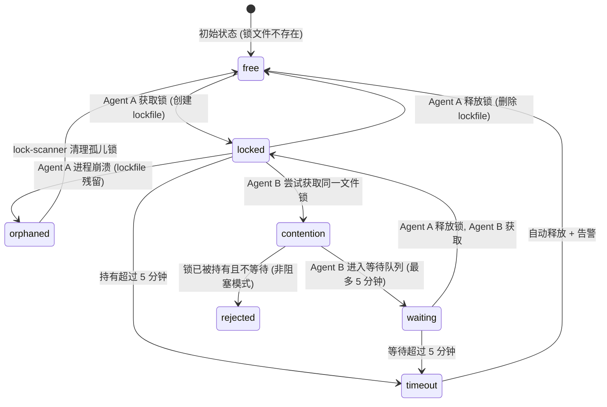

<!--
  Synova 创始人控制塔系统 | 第四章：写入锁
  版本: v1.0 | 日期: 2026-07-22 | 作者: Synova 研究组
  定位: 架构设计文档——定义多 Agent 并行执行时的文件写入锁机制，防止写入冲突与数据损坏
  前置输入: AGENTS.md 铁律 24 (异常处理审计), 铁律 31 (降级信号传播), 已知错误 #23 (D97+D98 同时写 app/css/app.css)
  与前后章节关系: 第三章(契约存档器)定义 Agent 间接口 → 第四章(本设计)保护文件写入安全 → 第五章(外部审计器)验证产出质量
-->

# 第四章：写入锁 (Write Lock)

> 多 Agent 并行场景下，文件写入前检查锁状态 → 先到先得 → 5分钟超时自动释放+告警 → 锁服务异常时降级不阻塞
> 2026-07-22 | 基于 AGENTS.md v4.4.5 铁律 24/31, 已知错误 #23

---

## 1. 问题定义

### 1.1 核心矛盾

当多个 Agent 并行执行时，两个 Agent 可能同时声明要修改同一个文件。历史上已发生：

- **已知错误 #23**: D97 + D98 同时修改 `app/css/app.css`，后提交的 Agent 覆盖了先提交的 Agent 的修改，造成静默数据丢失。

现有系统缺少任何文件写入锁机制。Agent 之间没有协调——每个 Agent 假设自己是唯一的写入者。

**核心主张**: 文件写入不是无状态的。在多 Agent 并行时，必须有轻量级的锁机制防止写入冲突。

### 1.2 适用范围

| 场景 | 写入锁行为 |
|------|-----------|
| **单 Agent 顺序执行** | **跳过写入锁**。只有一个 Agent 在工作，不存在冲突可能，锁检查是纯粹的耗时浪费。 |
| **多 Agent 并行执行** | **启用写入锁**。两个及以上 Agent 同时运行（如 Sentinel 扫描 + FDE 诊断 + 管理员手动触发）时，所有文件写入操作前必须获取锁。 |

判断逻辑：

```
function shouldUseWriteLock(): boolean {
  const activeAgents = countActiveAgents();
  return activeAgents > 1;
}
```

### 1.3 设计目标

| 目标 | 描述 | 对应铁律 |
|------|------|----------|
| 冲突防护 | 两个 Agent 不能同时写入同一个文件 | 已知错误 #23 |
| 超时释放 | 锁持有超过 5 分钟自动释放 + 告警 | 铁律 31 (降级信号传播) |
| 降级安全 | 锁服务不可用时记录告警，不阻塞写操作 | 铁律 24 (异常处理审计) |
| 轻量零依赖 | 基于文件系统 lockfile，不引入外部锁服务 | 架构原则: 最小依赖 |

---

## 2. 系统架构

### 2.1 锁服务设计

```
PostToolUse Hook 触发
        │
        ▼
┌─────────────────────────────────┐
│  shouldUseWriteLock()?          │
│  activeAgents > 1?               │
└──────────┬──────────────────────┘
           │
    ┌──────┴──────┐
    │ 否           │ 是
    ▼              ▼
  跳过锁     acquireLock(filePath)
  直接写入        │
            ┌─────┴─────┐
            │ 成功      │ 失败(已被持有)
            ▼           ▼
         写入文件    waitForLock(filePath, timeout=5min)
            │           │
            ▼      ┌────┴────┐
         releaseLock│ 超时    │ 获取成功
                    ▼         ▼
              告警+跳过锁   写入文件
              强制写入         │
                            releaseLock
```

### 2.2 锁存储

锁文件存储在 `.codex/locks/` 目录下，文件名为目标文件的路径 hash（SHA256 前 16 位）：

```
.codex/locks/
  ├── a3f8c2e1.lock    # 对应 src/agent/conversation-engine.ts
  ├── b7d1e9f4.lock    # 对应 packages/engine-core/src/pipeline/diagnosis.ts
  └── c2a5f8b0.lock    # 对应 app/css/app.css
```

每个锁文件内容为 JSON：

```json
{
  "agentId": "codex-agent-d97",
  "targetFile": "app/css/app.css",
  "acquiredAt": "2026-07-22T10:30:00+08:00",
  "pid": 12345,
  "operation": "write"
}
```

### 2.3 组件清单

| 组件 | 文件路径 | 职责 |
|------|----------|------|
| 锁管理器 | `scripts/lock/lock-manager.sh` | 获取/释放/等待锁，超时管理 |
| 锁状态扫描 | `scripts/lock/lock-scanner.sh` | Cron 定期扫描孤儿锁（进程已死但锁仍在） |
| PostToolUse 集成 | `scripts/workflow/hook-post-tool-use.sh` | 在文件写入前调用 lock-manager.sh |

---

## 3. 锁的生命周期

### 3.1 状态转换



### 3.2 获取锁 (acquire)

```bash
# scripts/lock/lock-manager.sh

acquire_lock() {
  local FILE="$1"
  local AGENT_ID="$2"
  local MODE="${3:-block}"  # block | nonblock

  local LOCK_DIR=".codex/locks"
  mkdir -p "$LOCK_DIR"

  local LOCK_HASH=$(echo -n "$FILE" | sha256sum | cut -c1-16)
  local LOCK_FILE="$LOCK_DIR/${LOCK_HASH}.lock"

  # 检查锁是否已存在
  if [ -f "$LOCK_FILE" ]; then
    local HOLDER=$(cat "$LOCK_FILE" | grep -o '"agentId":"[^"]*"' | cut -d'"' -f4)
    local ACQUIRED_AT=$(cat "$LOCK_FILE" | grep -o '"acquiredAt":"[^"]*"' | cut -d'"' -f4)
    local NOW=$(date -u +%s)
    local LOCK_TIME=$(date -u -d "$ACQUIRED_AT" +%s 2>/dev/null || echo 0)
    local ELAPSED=$((NOW - LOCK_TIME))

    # 超时检查: 持有超过 300 秒 (5 分钟)
    if [ "$ELAPSED" -gt 300 ]; then
      echo "WARN: Lock for $FILE held by $HOLDER for ${ELAPSED}s, auto-releasing"
      rm -f "$LOCK_FILE"
      # 推送告警到仪表盘
      push_lock_alert "timeout" "$FILE" "$HOLDER" "$ELAPSED"
    else
      if [ "$MODE" = "nonblock" ]; then
        return 1  # 非阻塞模式，立即返回失败
      fi
      # 阻塞模式，等待
      return $(wait_for_lock "$LOCK_FILE" "$AGENT_ID")
    fi
  fi

  # 创建锁文件 (原子操作)
  echo "{\"agentId\":\"$AGENT_ID\",\"targetFile\":\"$FILE\",\"acquiredAt\":\"$(date -u +%Y-%m-%dT%H:%M:%SZ)\",\"pid\":$$,\"operation\":\"write\"}" > "$LOCK_FILE"
  return 0
}
```

### 3.3 等待锁 (wait)

```bash
wait_for_lock() {
  local LOCK_FILE="$1"
  local AGENT_ID="$2"
  local MAX_WAIT=300  # 5 分钟
  local WAITED=0
  local INTERVAL=5    # 每 5 秒检查一次

  while [ -f "$LOCK_FILE" ] && [ "$WAITED" -lt "$MAX_WAIT" ]; do
    sleep "$INTERVAL"
    WAITED=$((WAITED + INTERVAL))
  done

  if [ -f "$LOCK_FILE" ]; then
    # 超时
    echo "WARN: Agent $AGENT_ID waited ${WAITED}s for lock on $LOCK_FILE, timeout"
    push_lock_alert "wait_timeout" "$LOCK_FILE" "$AGENT_ID" "$WAITED"
    return 2
  fi

  return 0
}
```

### 3.4 释放锁 (release)

```bash
release_lock() {
  local FILE="$1"
  local AGENT_ID="$2"

  local LOCK_DIR=".codex/locks"
  local LOCK_HASH=$(echo -n "$FILE" | sha256sum | cut -c1-16)
  local LOCK_FILE="$LOCK_DIR/${LOCK_HASH}.lock"

  if [ -f "$LOCK_FILE" ]; then
    local HOLDER=$(cat "$LOCK_FILE" | grep -o '"agentId":"[^"]*"' | cut -d'"' -f4)
    if [ "$HOLDER" = "$AGENT_ID" ]; then
      rm -f "$LOCK_FILE"
    else
      echo "WARN: Agent $AGENT_ID attempted to release lock held by $HOLDER"
      return 1
    fi
  fi
  return 0
}
```

---

## 4. 并行冲突场景

### 4.1 场景: 两个 Agent 同时写入同一文件

```
时间轴 →

Agent A (D97):
  10:30:00  acquireLock("app/css/app.css") → 成功
  10:30:01  开始写入 app/css/app.css
  10:30:05  写入完成
  10:30:06  releaseLock("app/css/app.css")

Agent B (D98):
  10:30:01  acquireLock("app/css/app.css") → 失败 (已被 Agent A 持有)
  10:30:01  进入等待队列...
  10:30:06  Agent A 释放锁 → Agent B 获取锁
  10:30:07  开始写入 app/css/app.css
  10:30:11  写入完成
  10:30:12  releaseLock("app/css/app.css")
```

### 4.2 场景: 超时强制释放

```
Agent A (D97):
  10:30:00  acquireLock("app/css/app.css") → 成功
  10:30:01  开始写入... (卡住，Agent 进程无响应)
  ...       (5 分钟过去，Agent A 仍未释放锁)
  10:35:01  锁超时 → 系统自动释放 + 告警推送到仪表盘

Agent B (D98):
  10:35:02  acquireLock("app/css/app.css") → 成功 (超时释放后锁空闲)
  10:35:03  开始写入 app/css/app.css
  10:35:07  写入完成
  10:35:08  releaseLock("app/css/app.css")
```

### 4.3 场景: 非阻塞模式 (仅检查不等待)

某些场景下（如只读操作），Agent 可以选择非阻塞模式：

```
Agent B:
  acquireLock("app/css/app.css", nonblock) → 失败
  跳过写入，记录告警: "文件被 Agent A 锁定，跳过写入"
  稍后重试或使用不同的文件名
```

---

## 5. 降级策略

### 5.1 锁服务不可用

当锁管理器无法正常工作时（例如 `.codex/locks/` 目录不可写、磁盘满、权限不足）：

```bash
acquire_lock() {
  # ... 正常逻辑 ...

  # 降级: 锁服务异常
  if [ $? -ne 0 ]; then
    echo "WARN: Lock service unavailable for $FILE, degrading to no-lock mode"
    log_lock_degradation "acquire_failed" "$FILE" "$AGENT_ID"
    return 0  # 返回成功 (降级: 不阻塞)
  fi
}
```

降级时的行为：

| 降级原因 | 处理 | 告警 |
|----------|------|------|
| .codex/locks/ 目录不可写 | 跳过锁，直接写入 | 仪表盘黄色信号: "写入锁服务降级" |
| 磁盘满 | 跳过锁，直接写入 | 仪表盘红色信号: "磁盘空间不足" |
| 锁文件损坏 (JSON 解析失败) | 删除损坏锁文件，重新创建 | 日志记录，不推送仪表盘 |
| 孤儿锁扫描器发现死进程锁 | 自动清理孤儿锁 | 日志记录 |

### 5.2 降级与铁律合规

- 每次降级必须有 `log.warn` 记录（铁律 24: catch 不能空吞）
- 降级状态通过 `degraded: true` 标记传播（铁律 31: 降级信号传播）
- PostToolUse hook 在其输出中附带 `lock_degraded: true` 字段，供上层系统判断

---

## 6. 孤儿锁清理

### 6.1 lock-scanner.sh

Cron 每 60 秒运行一次，扫描 `.codex/locks/` 下的所有锁文件：

```bash
#!/bin/bash
# scripts/lock/lock-scanner.sh — 孤儿锁清理

LOCK_DIR=".codex/locks"
[ ! -d "$LOCK_DIR" ] && exit 0

for lockfile in "$LOCK_DIR"/*.lock; do
  [ ! -f "$lockfile" ] && continue

  PID=$(grep -o '"pid":[0-9]*' "$lockfile" | grep -o '[0-9]*')
  AGENT_ID=$(grep -o '"agentId":"[^"]*"' "$lockfile" | cut -d'"' -f4)
  ACQUIRED_AT=$(grep -o '"acquiredAt":"[^"]*"' "$lockfile" | cut -d'"' -f4)

  # 检查进程是否存在
  if [ -n "$PID" ]; then
    if kill -0 "$PID" 2>/dev/null; then
      # 进程仍存活，检查持有时间
      NOW=$(date -u +%s)
      LOCK_TIME=$(date -u -d "$ACQUIRED_AT" +%s 2>/dev/null || echo 0)
      ELAPSED=$((NOW - LOCK_TIME))
      if [ "$ELAPSED" -gt 300 ]; then
        echo "ORPHAN: $lockfile held by $AGENT_ID (PID $PID) for ${ELAPSED}s, releasing"
        rm -f "$lockfile"
        push_lock_alert "orphan_timeout" "$(grep -o '"targetFile":"[^"]*"' "$lockfile" | cut -d'"' -f4)" "$AGENT_ID" "$ELAPSED"
      fi
    else
      # 进程已死，孤儿锁
      echo "ORPHAN: $lockfile held by dead process $PID, cleaning up"
      rm -f "$lockfile"
      push_lock_alert "orphan_dead" "$(grep -o '"targetFile":"[^"]*"' "$lockfile" | cut -d'"' -f4)" "$AGENT_ID" "0"
    fi
  fi
done
```

### 6.2 告警格式

```typescript
interface LockAlert {
  type: 'lock';
  reason: 'timeout' | 'wait_timeout' | 'orphan_timeout' | 'orphan_dead' | 'degraded';
  file: string;
  holdingAgent: string;
  elapsedSeconds: number;
  severity: 'yellow' | 'red';
  timestamp: string;
}
```

---

## 7. PostToolUse 集成

### 7.1 Hook 修改

在 PostToolUse hook (`scripts/workflow/hook-post-tool-use.sh`) 中，文件写入操作前插入锁检查：

```bash
# 在 PostToolUse hook 中，所有 write_file / apply_patch 操作前:

if should_use_write_lock; then
  AGENT_ID="${CODEX_AGENT_ID:-unknown}"
  for target_file in "${WRITE_TARGETS[@]}"; do
    bash scripts/lock/lock-manager.sh acquire "$target_file" "$AGENT_ID" block
    LOCK_RESULT=$?
    if [ $LOCK_RESULT -eq 2 ]; then
      # 等待超时
      echo "WARN: Lock wait timeout for $target_file, forcing write with alert"
    elif [ $LOCK_RESULT -ne 0 ]; then
      # 锁获取失败（非阻塞模式被拒绝）
      echo "WARN: Could not acquire lock for $target_file, skipping write"
      continue
    fi
  done
fi

# ... 执行实际文件写入 ...

# 写入完成后释放锁
if should_use_write_lock; then
  for target_file in "${WRITE_TARGETS[@]}"; do
    bash scripts/lock/lock-manager.sh release "$target_file" "$AGENT_ID"
  done
fi
```

### 7.2 与现有验证流程的关系

```
PostToolUse hook 执行顺序:
  1. 写入锁获取          ← 新增 (本章)
  2. 执行文件写入
  3. 写入锁释放          ← 新增 (本章)
  4. verify-incremental.sh (L1 oxlint → L2 tsc → L3 vitest → L4 接线审计)
  5. check-baseline.sh
```

锁的范围仅覆盖步骤 2（实际的写入操作）。步骤 4-5 的验证不持有锁，不影响其他 Agent 的写入。

---

## 8. 测试规范

### Test Requirements

| 测试层 | 类型 | Fixture 数量 | 覆盖场景 |
|--------|------|-------------|----------|
| L1 (单元) | `lock-manager.test.ts` | 5 | 正常获取+释放、冲突时阻塞等待、超时自动释放、非阻塞模式拒绝、释放他人锁被拒绝 |
| L1 (单元) | `lock-scanner.test.ts` | 3 | 孤儿锁清理(进程已死)、存活进程锁不清理、超时存活锁强制清理 |
| L1 (单元) | `should-use-lock.test.ts` | 3 | 单 Agent 返回 false、多 Agent 返回 true、activeAgents 计数异常降级为 true |
| L2a (集成) | `lock-integration.integration.test.ts` | 3 | 两个进程争抢同一文件锁、锁服务目录不可写降级、锁文件损坏自动恢复 |
| L2c (E2E) | `lock-e2e.e2e.test.ts` | 2 | 完整流程: Agent A 持有锁 → Agent B 等待 → A 释放 → B 获取 / 超时场景 → 告警推送 |

### Wiring Verification

| 新 export | 调用方文件 | 调用方函数 |
|-----------|-----------|-----------|
| `acquire_lock()` (lock-manager.sh) | `scripts/workflow/hook-post-tool-use.sh` | 文件写入前调用 |
| `release_lock()` (lock-manager.sh) | `scripts/workflow/hook-post-tool-use.sh` | 文件写入后调用 |
| `should_use_write_lock()` (lock-manager.sh) | `scripts/workflow/hook-post-tool-use.sh` | 判断是否启用锁 |
| `scan_orphan_locks()` (lock-scanner.sh) | `scripts/cron/lock-cleanup.cron` | Cron 每 60s 调用 |

---

## 9. 文件清单

| 文件 | 类型 | 说明 |
|------|------|------|
| `scripts/lock/lock-manager.sh` | 新增 | 锁获取/释放/等待核心逻辑 |
| `scripts/lock/lock-scanner.sh` | 新增 | 孤儿锁定时清理 |
| `scripts/cron/lock-cleanup.cron` | 新增 | Cron 调度: `*/1  *  *  *  * bash scripts/lock/lock-scanner.sh` |
| `.codex/locks/` | 新增目录 | 锁文件存储 (gitignore) |
| `scripts/workflow/hook-post-tool-use.sh` | 修改 | 集成写入锁逻辑 |

---

> 下一章: [第五章：外部审计器](./SYNOVA-RESEARCH-第五章-外部审计器-v1-0-20260722.md) — 基于 23 项已知错误模式的自动化代码审计