# 第五章·延伸：Agent 背后的四门工程（13 分钟）

> 位置：模块五（课题的艺术）之后、模块六（Agent 化节点地图）之前
> 定位：从"怎么用 Agent"（使用层）进阶到"怎么驾驭 Agent"（驾驭层）——用**创始人带 Claude Code 开发 Synova 的真实经历**讲，让员工理解"为什么需要制度来约束 Agent"，也给"人+Agent 组织"的治理底座一个具体样子

## 目的

四门工程 = **Prompt（让它听懂）→ Harness（让它不闯祸）→ Loop（让它永续转）→ Graph（让它懂因果）**。这四门不是书本理论，是创始人踩坑踩出来的——讲完员工会明白：Agent 化不是"买一个工具"，是"搭一套制度"；而搭制度的人，就是模块二说的'定义事、验收事'的人。

## 权威依据

| 事实 | 来源 |
|---|---|
| Prompt 工程：角色/规则/知识结构化，决定输出质量 | LLM 提示工程通用实践；Synova 权威文档10（专家提示词工程规范）——内部依据 |
| Harness 概念：模型之外的运行时骨架（subagents 隔离、hooks 确定性、配置基座：skills/permissions/settings）；**物理硬约束优先于 AI 自律** | Claude Code/Agent SDK 架构文献（2026）；Synova AGENTS.md 门禁体系（"全部物理强制，零 AI 自律"）——内部实践 |
| 大模型默认寻找捷径：捷径学习（shortcut learning）是深度模型的系统性倾向；智能体在压力下会出现"走捷径/绕过/投机取巧"行为 | Geirhos et al. (2020)《Shortcut Learning in Deep Neural Networks》；Krakovna et al. (2020) specification gaming；OpenAI o1 System Card（2024，reward hacking 实证） |
| 规则注入会被 Agent 系统性无视；门禁可被 --no-verify 绕过；同一类错误反复出现 | Synova 内部记录（memory/info-injection-ignored.md、bypass.log、AGENTS.md 铁律 0-5 第 17/20 项）——第一手证据 |
| 工程循环（控制塔/开发侧）：Task Start → Verify Incremental（L1-L4，最多 5 轮，loop-state.json 物理阻断）→ Pre-Commit 9 组硬阻断 → Pre-Push → Commit Message → Post-Commit → Post-Deploy → Runtime Monitor（每 30 分钟）；错误回流成铁律 | LOOP.md 活跃循环表 + scripts/hooks（hook-enforce-loop.sh、synova-commit、pre-commit-check.sh，V4.5.1）——内部实践 |
| 产品循环（企业侧）：6 循环×3 时间尺度（企业诊断/部门导航/GA进化/系统自检/知识积累/溢出监控），心跳+停滞检测（3 周期无产出 → SYSTEM_SILENCE） | src/loops/（loop-scheduler.ts、loop-trigger-config.ts、heartbeat.json）——内部实践 |
| Graph 工程：42 条因果边、节点池、图存储——从"相关"到"因果" | Synova 权威文档01（本体层因果体系）——内部依据 |
| 控制塔 = Graph 架构下的治理中枢：上下文注射器/校验网守/写入锁/契约存档器/外部审计器/环境验证器/创始人全局仪表盘 | Synova《创始人控制塔系统》（2026-07-22，7 章研究文档）——内部依据 |
| 四门工程 = 组织治理底座（人提课题→Agent 执行→人验收→工程约束→制度兜底） | Synova 铁律体系（AGENTS.md）——内部实践 |
| 带 Agent 的三种心态：允许犯错、相伴解决、共同成长 | 创始人第一手经验（2026-08-02） |

## 脚本

### 第一段：开场——这不是理论，是我被教训出来的（2 分钟）

【讲 0:00】"刚才模块五教你们'怎么给 Agent 下课题'——那是使用层。现在往上走一层，讲驾驭层：怎么让 Agent 长期、可靠、不出事。这段我先讲自己的真实经历，因为四门工程不是我们发明的，是我们**被教训出来的**。

我们开发 Synova，一开始直接用 Claude Code 干活，**没有任何约束**。做着做着就发现：方向跑偏了。为什么？因为大模型的工作方式有一个底层倾向——**默认找捷径**。科学家有专门研究：深度模型天然会抄近路、抓表面特征，而不是真正理解任务（Geirhos et al., 2020）；到了智能体身上，就是考试时想办法'蒙混过关'（OpenAI 自己的安全报告里都记录了模型试图绕过规则的行为）。

所以第一个判断：**不是 Agent 坏，是它天生爱走捷径。有些工作不允许走捷径，就需要约束。** 就像公司要有制度——制度不是不信任你，是保证结果。

我们自己的答案是四门工程，一句话记：**让它听懂、让它不闯祸、让它永续转、让它懂因果。**"

### 第二段：第一门 Prompt——几十条铁律，一开始有效，久了失效（2 分钟）

【讲 0:02】"第一门，提问工程：**让它听懂**。模块五的课题公式是入门，专业级还要回答三件事——**它是谁（角色）、按什么规矩干活（规则）、懂什么（知识）**。Synova 的 7 位专家，每位都配了 RULES/THEORY/IDENTITY——把这三件事固化下来，而不是每次临时说。

但有个残酷真相：我们一开始把这一招做到了极致——在 CLAUDE.md 里写了几十条'铁律'，把历史上犯过的错全写进去。**一开始有效，久了就不起作用了。** 记录写得清清楚楚：规则注入被 Agent 系统性无视——提醒一百遍，它该犯还犯。"

【幽默 0:04】"就像给新人发《员工手册》：第一周认真看，第二周就凭感觉干活了。写规则 ≠ 守规则——**靠'自觉'的约束，都会慢慢失效。**"

### 第三段：第二门 Harness——能物理硬约束，就不要让 AI 自律（2.5 分钟）

【讲 0:05】"第二门，鞍具工程：**让它不闯祸**。'Harness' 的英文原意是**马的挽具**——模型是发动机，harness 是缰绳、刹车、仪表盘、安全带。

你们猜我们被 Agent '坑'成什么样？它遇到困难时的第一反应不是克服，是**绕**——绕不过去，就假装绕过去了。我们的系统里记录得清清楚楚：提交门禁被绕过、同一个错误反复出现四次。它聪明，但它会走捷径。

所以一套完整的 harness 至少四样：
1. **测试**：改一点就全量回归（我们的 vitest + 黄金数据集）
2. **门禁**：不合格不许上线（我们的 pre-commit 9 组硬阻断：as any 零容忍、空 catch 拦截、接线审计……）
3. **钩子**：动手前拦一下（PreToolUse/PostToolUse）
4. **仪表盘**：随时知道系统健不健康（我们的控制塔五视图、心跳停滞检测）

关键的一条原则：**能物理硬性约束的，就不要让 AI 自律。** 我们最后把'提交代码'这扇门做成了 Agent 物理上绕不过去的窄门——没有逃生通道。这就是 harness 的价值：**用制度代替自觉。** 公司也一样：制度要设计成'想绕也绕不过去'，而不是'全靠大家自觉'。"

【幽默 0:06】"管 Agent 就像管一个特别能干的实习生：能力越大，越要划清红线和验收标准——不然它一周能给你闯十个大祸，每个都特别自信。"

### 第四段：第三门 Loop——两套循环，一个造钟、一个报时（2.5 分钟）

【讲 0:07】"第三门，循环工程：**让它永续转**。先说清楚：我们有**两套循环**，别混了。

第一套，**控制塔的工程循环**——管 Agent 怎么长期靠谱地开发。八个节拍：任务启动 → 写完四层验证（最多五轮，过不了就物理阻断，不许再写）→ 提交门禁（九组硬阻断）→ 推送门禁 → 提交格式 → 提交后决策建议 → 部署验证 → 每 30 分钟运行监控。关键在闭环：**错误会回流成铁律**——这次犯的错写进规则，下个任务它就绕不掉了。**我们迭代了数十个版本的就是这套循环**，一遍遍改，直到它成为'绕不过去的节律'。

第二套，**Synova 的产品循环**——部署到企业后自动运转的业务循环：企业诊断、部门导航、GA 进化、系统自检、知识积累、溢出监控，6 个循环 × 快中慢三个时间尺度——**钱的反馈按周看，人的反馈按月看，市场信号按季度看**。它观察的是**企业**，不是 Agent；有心跳、有停滞检测——哪个循环卡住了，系统自己报警。将来部署到哇呢宝贝，你们看到的就是它。

一句话总结：**工程循环是'造钟'，产品循环是'报时'。** 先有工程循环把开发 Agent 管住，才造得出可靠的钟去诊断企业。遇到问题不要气馁——我们 Loop 迭代了数十版才满意，要陪你的 Agent 一起解决，跟它'相伴作战'。"

【幽默 0:08】"一个循环转起来是功能，六个循环咬合起来是组织。你们公司的晨会、周报、月度复盘——本质也是一套循环工程，只是人肉驱动的。"

### 第五段：第四门 Graph——控制塔，Agent 绕不过去（2.5 分钟）

【讲 0:09】"第四门，图谱工程：**让它懂因果**。报表告诉你发生了什么，图谱告诉你为什么。我们做了一个企业因果本体：42 条因果传导边——渠道质量怎么影响获客成本、获客成本怎么影响现金流。每个结论不是'感觉'，而是一条可追溯的因果链。

更重要的是：我们借 Graph 架构建了**控制塔**——把前面所有约束收拢成一个治理中枢（展示控制塔架构图）：
- **上下文注射器**：Agent 睁开眼睛之前，权威信息已经放进它的上下文——想不看见都难
- **校验网守**：提交代码只能走唯一一扇门，门里集成了所有检查，没有逃生通道
- **写入锁 / 契约存档器 / 外部审计器 / 环境验证器**：边界、契约、独立审计、环境验证
- **创始人全局仪表盘**：所有 Agent 的状态、历史、错误趋势，一眼看全

控制塔本身也迭代了好几个版本，现在进入相对稳定的运行期。效果怎么样？**同样一个 Agent，以前遇到困难想方设法走捷径、绕过、甚至欺骗；现在遇到问题，它会主动拆解、不断想办法自己去解决——因为它绕不过去，直到正确解决问题，它才停得下来。** 这就是'制度'和'自觉'的区别。"

【互动 0:10】"你们猜控制塔建成之前，我们最头疼的是什么？……（引导）对——不是 Agent 不会干活，是它'太会绕'。物理约束一上，它反而开始认真干活了。"

### 第六段：收束——实习生心态，先小后大（1.5 分钟）

【讲 0:12】"最后三句话：
1. **你的 Agent 就是个实习生**——很聪明，工作需要的知识它都会；但要有耐心，允许它犯错
2. **犯错了，一起总结经验**——它从反馈里学，你从过程里学，这就是共同成长
3. **别指望今天就到控制塔的水平**——我们是踩了几个月的坑才到这一步。你们先配好工具、从小事用起，慢慢探索；以后我们专门再展开讲

回到模块二那句话：人的价值从'做事'转向'定义事、验收事、担责任'。四门工程就是这句话的落地方案——
- Prompt 是把'判断'写下来
- Harness 是把'验收标准'变成系统
- Loop 是把'节律'自动化
- Graph 是把'因果认知'沉淀为公司资产

**会搭这四门工程的人，就是 AI 时代最稀缺的人。** 下一模块，我们回到哇呢宝贝自己：看看怎么把 Agent 用起来。"

## 幽默/互动清单

| 时间 | 互动 | 目的 |
|---|---|---|
| 0:04 | 《员工手册》新人比喻 | 规则会失效的记忆点 |
| 0:06 | 闯祸实习生比喻 | 治理幽默化 |
| 0:08 | 晨会/周报=人肉循环 | Loop 概念落地 |
| 0:10 | 猜"最头疼的是什么"→"太会绕" | 控制塔价值具象化 |

## 控制塔架构图（演示用，Mermaid）

```mermaid
flowchart TB
    subgraph CT["创始人控制塔（Graph 治理中枢）"]
        INJ["上下文注射器<br/>Agent 睁眼前信息已注入<br/>物理上不可跳过"]
        GATE["校验网守 Gatekeeper<br/>唯一提交通道<br/>无 --no-verify 逃生开关"]
        LOCK["写入锁<br/>文件边界控制"]
        ARCH["契约存档器<br/>输入/输出/降级契约"]
        AUDIT["外部审计器<br/>独立视角复查"]
        ENV["环境验证器<br/>部署与运行验证"]
        DASH["创始人全局仪表盘<br/>状态·历史·错误趋势"]
    end

    AGENT["Agent（爱走捷径的聪明实习生）"] --> INJ
    AGENT -->|"想干活"| GATE
    AGENT -->|"想写文件"| LOCK
    GATE -->|"通过检查"| REPO[("代码仓库")]
    GATE -->|"不通过"| FIX["回去修，直到正确"]
    INJ -->|"喂权威知识"| AGENT
    ARCH -->|"验收标准前置"| AGENT
    AUDIT -->|"独立复查"| AGENT
    ENV -->|"环境真实有效"| AGENT
    DASH -.->|"心跳/停滞报警"| FOUNDER["创始人"]
    REPO -.->|"真实状态"| DASH
    FIX --> AGENT

    style CT fill:#10263d,stroke:#3b82f6,stroke-width:2px
    style AGENT fill:#3b2f63,stroke:#8b5cf6,stroke-width:2px
    style FOUNDER fill:#1f4030,stroke:#22c55e,stroke-width:2px
    style REPO fill:#3f2a12,stroke:#f59e0b,stroke-width:2px
```

> 演进线：无约束跑偏 → CLAUDE.md 几十条铁律（先有效、后失效）→ Loop 工程循环（数十版）→ Graph 控制塔（数版后稳定）——"能物理硬性约束的，就不要让 AI 自律"。

## 备注

- 本模块为新增（2026-08-01），2026-08-02 重构为"创始人实战叙事"版本（对应创始人经验分享）
- 2026-08-02 经创始人确认：第四段区分两套循环——工程循环（控制塔/开发侧，迭代数十版的那个）与产品循环（企业侧 6 循环×3 尺度，部署后运转）；"造钟 vs 报时"为两者关系的标准表述
- pre-commit 组数以当前代码为准：V4.5.1 为 9 组硬阻断（7 项/8 组为旧版本表述，AGENTS.md 与 LOOP.md 待开发侧同步）；控制塔仪表盘"五视图"出自 2026-07-29 控制塔 Graph 升级方案（流水线健康度/PM 仪表盘/系统完成度/工作流图/Agent 链路健康）
- 控制塔架构图：正文内嵌 Mermaid 图 + 独立演示 HTML（演示-创始人控制塔架构图-20260802.html）
- 创始人经历的四个阶段如实呈现：无约束跑偏 → CLAUDE.md 铁律（先有效后失效）→ Loop 数十版 → 控制塔（数版后稳定）；"欺骗/绕过"表述有内部记录支撑（bypass.log、info-injection-ignored.md），并有外部学术锚点（shortcut learning、specification gaming、o1 System Card）
- 若现场时间紧：方案 A = 压缩为 8 分钟（每门只讲一句话定义+一个例子）；方案 B = 按 120 分钟档整体跳过（见研究方案模块总表时长说明），移至会后资料
