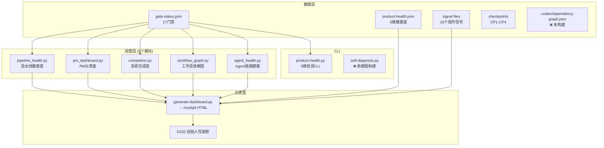
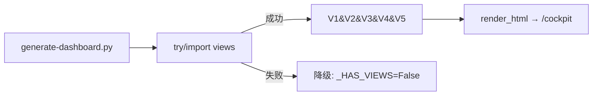

# 控制塔 V3 当前状态

> 2026-07-30 | 全部 5 个视图模块 + 5 维健康度 CLI 已完成

---

## 一、架构总览



## 二、5 个视图模块状态

| 视图 | 文件 | 状态 | 输入 | 输出 |
|------|------|------|------|------|
| **V1** 流水线健康度 | `pipeline_health.py` | ✅ | CP1-CP4 JSON → 三行 HTML | healthy/degraded/unknown |
| **V2** PM仪表盘 | `pm_dashboard.py` | ✅ | gate-status.json → 进度+快照 | 完成度% + 退化维度 |
| **V3** 系统完成度 | `completion.py` | ✅ | gate-status.json → 17门禁统计 | 加权进度 + 聚合图 |
| **V4** 工作流依赖图 | `workflow_graph.py` | ✅ | dependency-graph.json → HTML | 依赖列表 + 节点计数 |
| **V5** Agent链路健康 | `agent_health.py` | ✅ | gate-status.json → 6专家表格 | 核心/扩展/P0激活三行 |

## 三、5 维健康度 CLI

```bash
python scripts/control-tower/product-health.py

# 输出:
product-health.json
  status=degraded  degradedCount=1  unknownCount=0
  pipeline:   healthy — Gate 3 pass
  sentinel:   healthy — 4/4 pass
  quality:    healthy — 3/3 pass
  loop:       degraded — loop-scheduler yellow
  resource:   healthy — CPU 25% / MEM 59% / DISK 14%
```

## 四、信号文件 (19个)

```
.codex/signals/
├── gate-status.json        ✅ 17门禁(100% PASS)
├── product-health.json     ✅ 5维健康度
├── external-auditor.json   ✅ 审计信号
├── loop-scheduler.json     ✅ 循环状态(yellow)
├── context-injector.json   ✅
├── gatekeeper.json         ✅
├── write-lock.json         ✅
├── env-validator.json      ✅
├── sentinel.json           ✅
└── + 9 个 D# 任务信号      ✅
```

## 五、仪表盘集成



## 六、当前缺失

| 组件 | 状态 | 原因 |
|------|------|------|
| `.codex/dependency-graph.json` | ❌ 未构建 | D267 仅内存构建，未持久化到文件 |
| `.codex/checkpoints/` 目录 | ❌ 空 | 需要 hook 写入（D260 代码已就绪但未触发） |
| `self-diagnosis.py` CLI | ⚠️ 存在但缺图 | 能运行但无图形输出接口 |

## 七、门禁进展

```
2026-07-24: 6 PASS / 7 PARTIAL / 4 FAIL (38%)
2026-07-26: 10 PASS / 7 PARTIAL / 0 FAIL (71%)  ← D219+D225
2026-07-27: 17 PASS / 0 PARTIAL / 0 FAIL (100%)  ← 全部修复
当前:      17 PASS / 0 PARTIAL / 0 FAIL (100%)
```
